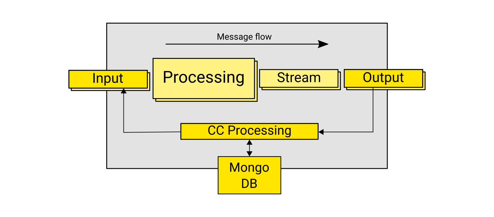
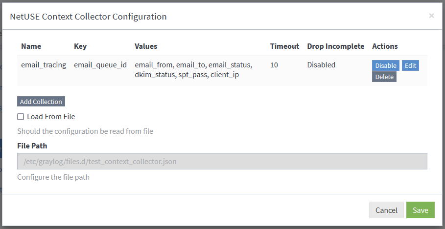
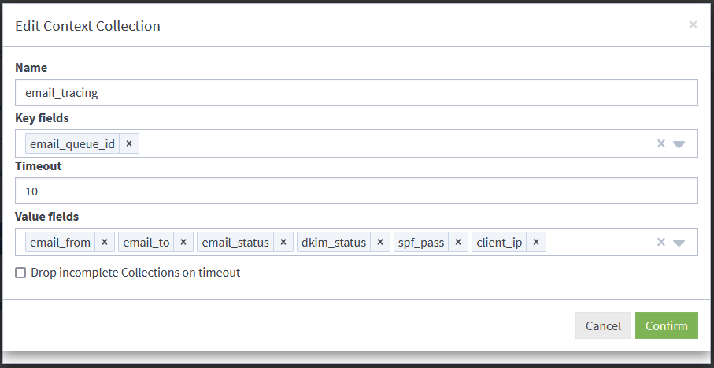

# NetUSE Context Collector plugin for Graylog

The Context Collector plugin for Graylog unifies information scattered over different messages, identified by shared field values, into one new singular message, enabling easier filtering/search and giving analyst a fast overview over multiline logs.

Common scenarios are the unification of multi-line messages such as E-Mail-Server logs,  Cisco ISE and ASA VPNs Logs or Active Directory Logs. It does not require additional infrastructure to run and is configurable via the Graylog WebUI. The context collector also supports cluster-installations, where relevant messages might arrive at different nodes.



## Installation 
Please refer to https://docs.graylog.org/docs/plugins#installing-and-loading-plugins for the latest instructions for loading a plugin into Graylog.

With graylog 6.0 and greater the Context Collector plugin class needs to be allowed within the server configuration:
```
safe_classes = org.graylog.,org.graylog2.,de.netuse.graylog.context_collector.config.PluginConfigurationV2
```
For more information on this see https://github.com/Graylog2/graylog2-server/pull/18180 


### Initial Configuration

For the Context Collector to work the input must be created and one output must be created and attached to at least one stream of interest.
#### Create the Context Collector Input

To create the input, go to System -> Inputs, select the “Context Collector Message Output” as new input and click “Launch Input”. In the configuration dialog tick the Global checkbox and give the input a name, such as “Context Collector Input”. Then create and start the input by clicking “Save”
#### Create the Context Collector Output

To attach the Context Collector Output to a stream the first time, go to the Streams page. For the desired stream select “More Actions” -> “Manage Output”. In the select box next to “Launch new Output” button, select the “Context Collector Output” as type. Click the button, in the configuration dialog give the output a name, such as “Context Collector Output”. Click Save to finish the setup. The output is now attached to the stream and processing messages.
#### Attach the Context Collector Output to an additional stream

It is not needed to create a new Output for each stream.  To attach additional streams to the output, go to the output management page for the respective streams via “More Actions” -> “Manage Outputs”. In the select box titled “Select existing output” select the Context Collector Output you created in the previous step. To finish click the button labelled “Assign existing Output”.

## How to configure a Context Collection

The configuration modal for the plugin can be found under System -> Configurations. Per default it is set to “Cluster Config”, which means that the configuration of the Collections is stored within Graylog. To support legacy deployments, it is possible to read the configuration from file.



Clicking the “Add Collection” button in the main configuration dialog for the plugin, creates a new empty collection. Clicking on the “Edit” Button in the row opens the configuration dialog for the collection. Here we can choose a proper name, the fields we want to match and collect, and the timeout. When the “Drop incomplete Collections on timeout” checkbox is ticked, collection items that did not collect all the fields specified will be discarded on timeout. There is no new message created for them.

Clicking the confirmation button brings us back to the main configuration dialog for the plugin. To save and automatically apply the changes click the Save button.




## Development
The plugin is set up to be compatible with the graylog-project-cli workflow.
This project is using Maven 3 and requires Java 8 or higher.

* https://github.com/Graylog2/graylog-project-cli
* https://github.com/Graylog2/graylog-project/blob/master/README.md

After the general set up, a manifest file is needed containing the location of the plugin:


```
{
  "includes": [ "3.1.json" ],
  "modules": [
    {
      "repository": "url_or_path_to_plugin_repo",
      "revision": "master",
      "assemblies": ["plugin-in"]
    }
  ]
}
```


* Run `mvn package` to build a JAR file.
* Optional: Run `mvn jdeb:jdeb` and `mvn rpm:rpm` to create a DEB and RPM package respectively.
* Copy generated JAR file in target directory to your Graylog plugin directory.
* Restart the Graylog server.

You can improve your development experience for the web interface part of the plugin
dramatically by making use of hot reloading. To do this, do the following:

* `cd graylog2-server/graylog2-web-interface`
* `ln -s $CONTEXT_COLLECTOR_PATH plugin/`
* `npm install && npm start`

This is what you want 99% of the time:

`mvn package -DskipTests -Dforbiddenapis.skip=true`


### Release Preparation
Before a new Context Collector release is created, run test\_generator.py against test\_context\_collector.json on a test cluster
and check that the context collector performs as expected.

